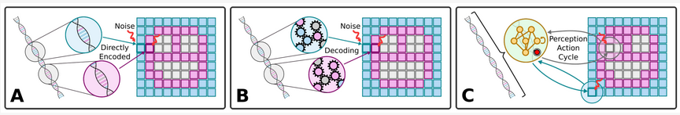
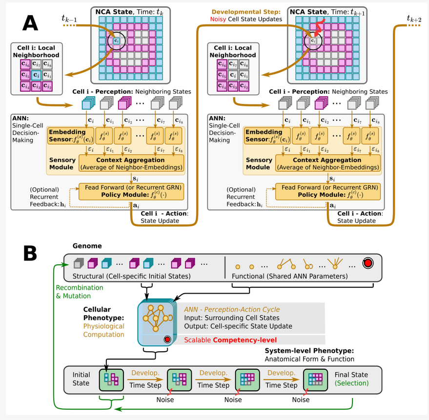

# Evolutionary Implications of Multi-Scale Intelligence
## Overview
A python implementation for cognitive evolution related to the _Technological Approach to Mind Everywhere_ (TAME) [^1] and _Darwin's Agential Material_ frameworks [^2], covering the following references:

### Project Structure
- Experiments and implementations to publications are located in the [./examples](examples) directory
- Code for the Hybrid NCA-Framework is located in the [./musepy](musepy) directory
- The evolutionary training stack depends on the [mindcraft](github.com/bhartl/NeurEvo) framework
- See also the [LICENSE](LICENSE) file for licensing information


### System information
- Python 3.8
- Ubuntu 22.04 LTS

### Notes
> The `mindcraft` framework is under active development and the API might change in the future. The framework is not fully documented, but we are working on it.

> **_WARNING:_**  The `mindcraft.io.Repr` class is used to represent native classes as yml files, which might also use `eval` to evaluate the class.

## Experiments
### __Evolutionary Implications of Multi-Scale Intelligence and NCAs__ [^3]
Implementations and examples to [^3] are located in the [examples/evolve](examples/evolve) directory.



### Aging as a loss of Goal-Directedness [^4]
Implementations to [^4] are located in the [examples/aging-as-loss-of-goal-directedness](examples/aging-as-loss-of-goal-directedness) directory.

 

## Hybrid NCA-Framework Overview
A Hybrid Neural Cellular Automaton (NCA) introduced in[^3] and used to evolve collective, multi-cellular agents with multi-scale developmental competency from initial (direct) encodings is implemented in the `musepy` package (see `./musepy`). The evolutionary training stack of `musepy` depends on the `mindcraft` framework (`https://github.com/bhartl/NeurEvo`).
See also the [./examples/evolve/README.md](examples/evolve/README.md) for further details on how to use the evolutionary training stack.



## Install
### Virtual Environment
The `musepy` framework should be installed in dedicated *virtual environments (venv)* to not compromise the system's *Python* installation. With *Anaconda*, a corresponding *muse venv* can be generated as follows:
```bash
conda create -n muse python=3.8
```
which can be activated via
```bash
conda activate muse
```

### Install as Editable Package
To install the `musepy` package, go to the root directory of the `multiscale-evolution` framework and run
```bash
pip install -e .
```

or for the _cpu-only version_ run
```bash
pip install -e . --extra-index-url https://download.pytorch.org/whl/cpu
```
(recommended - the code is written for mpi4py parallelization -- see [install detailed instruction for `mpi4py`](https://github.com/bhartl/NeurEvo?tab=readme-ov-file#dependencies-local) or try running `conda install mpi4py`)

### Dependencies
The repository depends on the `mindcraft` framework, see [https://github.com/bhartl/NeurEvo](https://github.com/bhartl/NeurEvo) for installation instructions (especially for `mpi4py` parallelization and acceleration, and licensing).

### Examples and Jupyter Notebooks
To  run the examples, analysis tools and Jupyter notebooks, the `examples` packages listed in the `project.optional-dependencies` of the [pyproject.toml](pyproject.toml) file are required.
These can be installed via
```bash
pip install -e .[examples]
```

To use the Jupyter notebooks, the `muse` kernel needs to be installed via
```bash
ipython kernel install --name "muse" --user
```

## Citation
If you use this code in your research, please cite the following publication:
```bibtex
@article{hartl2024evolutionary,
    author = {Hartl, Benedikt and Risi, Sebastian and Levin, Michael},
    title = {Evolutionary Implications of Self-Assembling Cybernetic Materials with Collective Problem-Solving Intelligence at Multiple Scales},
    journal = {Entropy},
    volume = {26},
    year = {2024},
    number = {7},
    article-number = {532},
    doi = {10.3390/e26070532}
}
```


## References
[^1]: "_Technological Approach to Mind Everywhere: An Experimentally-Grounded Framework for Understanding Diverse Bodies and Minds_",
<br>by M. Levin, Frontiers in Systems Neuroscience 2022, **16**; https://doi.org/10.3389/fnsys.2022.768201

[^2]: "_Darwin’s agential materials: evolutionary implications of multiscale competency in developmental biology_",
<br>by M. Levin, Cellular and Molecular Life Sciences 2023, **80**, 142; https://doi.org/10.1007/s00018-023-04790-z

[^3]: "_Evolutionary Implications of Self-Assembling Cybernetic Materials with Collective Problem-Solving Intelligence at Multiple Scales_", 
<br>by B. Hartl, S. Risi, M. Levin, Entropy 2024, **26**(7), 532; https://doi.org/10.3390/e26070532

[^4]: "_Aging as a Loss of Goal-Directedness: An Evolutionary Simulation and Analysis Unifying Regeneration with Anatomical Rejuvenation_", 
<br> by L. Pio-Lopez*, B. Hartl* M. Levin, Advanced Science 2025, https://doi.org/10.1002/advs.202509872 (* equal contribution)
