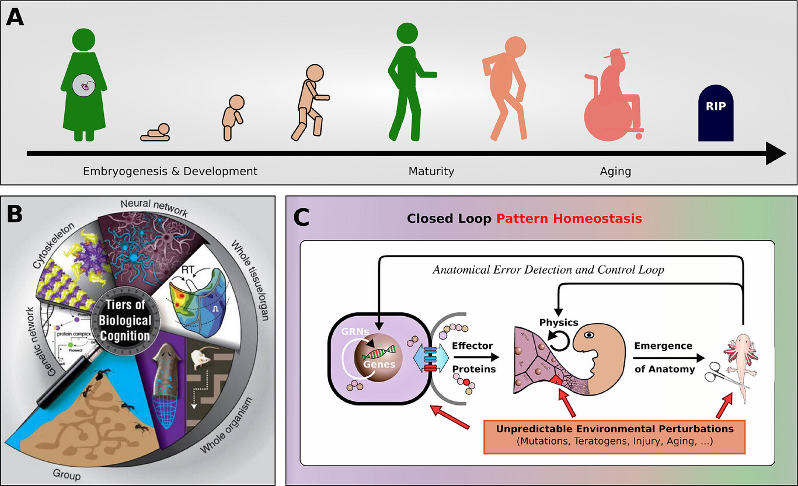
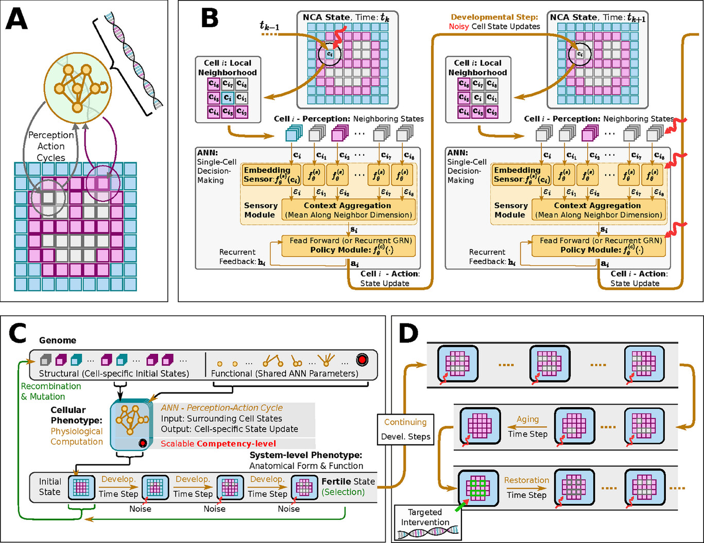

# Aging as Loss of Goal-Directedness

Here we address biological aging in terms of the _loss of anatomical goal-directedness_ of cellular agents in the integrated tissue of a Neural Cellular Automaton (NCA).

## References
[^1]: "_Aging as a Loss of Goal-Directedness: An Evolutionary Simulation and Analysis Unifying Regeneration with Anatomical Rejuvenation_", 
<br> by L. Pio-Lopez$^\dagger$, B. Hartl$^\dagger$ M. Levin, Advanced Science 2025, https://doi.org/10.1002/advs.202509872 ($^\dagger$ equal contribution)

[^2]: "_Evolutionary Implications of Self-Assembling Cybernetic Materials with Collective Problem-Solving Intelligence at Multiple Scales_", 
<br>by B. Hartl, S. Risi, M. Levin, Entropy 2024, **26**(7), 532; https://doi.org/10.1007/s00018-023-04790-z

## Project Structure
Here, we specify testing pipeline for aging NCAs to assemble different target tissues, such as a smiley-face pattern.

The agents have been pretrained via the [examples/evolve](../evolve) framework from [^2], and the (pre)evolved agents are located in the [agents](./agents) directory.

In [this notebook](aging-smiley_16x16-schedule.ipynb), we modify the competency level of pretrained NCAAgents by means of
- increasing the noise of the actions of all agents, or/and
- decreasing the "decision-making-probability", or/and
- adding noise to the neural network parameters of each agent, or/and
- reducing the connectivity between the agents in the tissue
during the lifetime of an NCA phenotype.

Moreover, we test different organ recovery strategies after damage in the [organ recovery notebooks](./aging-smiley_16x16-recovery-organ-loss.ipynb) and [organ+socket recovery notebooks](./aging-smiley_16x16-recovery-socket-loss.ipynb).

To run the code, make sure, to load both the `mindcarft` and the `musepy` modules are installed, see [Install](../../README.md#install) for details.

- The [`./aging.py`](aging.py) file contains the main code for the aging experiments.
- The [`./recovery.py`](recovery.py) file contains code for recovery experiments after damage.

The `aging` experiments can be run in a *Jupyter Notebook*, which is located in the `examples/aging-as-loss-of-goal-directedness` directory:
- [aging-smiley_16x16-schedule.ipynb](./aging-smiley_16x16-schedule.ipynb) analyses different aging schedules for the smiley-face pattern,
- [aging-smiley_16x16-recovery-eye-loss.ipynb](aging-smiley_16x16-recovery-organ-loss.ipynb) analyses recovery after eye loss by injecting embryonic information,
- [aging-smiley_16x16-recovery-eye-loss-and-socket.ipynb](aging-smiley_16x16-recovery-socket-loss.ipynb) analyses recovery after eye loss by injecting embryonic information of the organ and its socket.

_Data_ are stored in the [data](./data) directory, and can be generated by running the scripts in the jupyter notebooks. Note that the data can be quite large (several GBs), depending on the number of experiments run, and might deviate slightly from the data used in the publication due to the stochastic nature of the experiments. Upon reasonable request, we can provide the exact data used in the publication.

## _Aging as a Loss of Goal-Directedness: An Evolutionary Simulation and Analysis Unifying Regeneration with Anatomical Rejuvenation_ [^1]

Although substantial advancements are made in manipulating lifespan in model organisms, the fundamental mechanisms driving aging remain elusive. No comprehensive computational platform is capable of making predictions on aging in multicellular systems. Focus is placed on the processes that build and maintain complex target morphologies, and develop an insilico model of multiscale homeostatic morphogenesis using Neural Cellular Automata (NCAs) trained by neuroevolution. In the context of this model: 
1) Aging emerges after developmental goals are completed, even without noise or programmed degeneration;
2) Cellular misdifferentiation, reduced competency, communication failures, and genetic damage all accelerate aging but are not its primary cause;
3) Aging correlates with increased active information storage and transfer entropy, while spatial entropy distinguishes two dynamics, structural loss and morphological noise accumulation; 
4) Despite organ loss, spatial information persists in tissue, implementing a memory of lost structures, which can be reactivated for organ restoration through targeted regenerative information; and
5) rejuvenation is found to be most efficient when regenerative information includes differential patterns of affected cells and their neighboring tissue, highlighting strategies for rejuvenation. 

This model suggests a novel perspective on aging as loss of goal-directedness, with potentially significant implications for longevity research and regenerative medicine.

---


**Fig. 1 from [^1]**: 
**A**) A schematic illustration of the stages of life of a complex organism, starting from embryogenesis, development and growth, through maturity, decline, aging, and eventually death. 
**B**) Multicellular organisms are composites of hierarchically interlocked layers of biological self-organization, spanning physical scales from the molecular level, over cells, tissues, organs, to organisms and even groups or collectives of individuals. Image by Jeremy Guay of Peregrine Creative. Used by permission from [[20](https://www.sciencedirect.com/science/article/abs/pii/S0006291X20320064?via%3Dihub)]. 
**C**) To develop an organism's morphology and sustain its integrity against environmental perturbations, biology maintains a multi-scale closed loop pattern homeostasis mechanism, where the components at every scale of self-organization are capable of self-regulatory and error-correcting behavior. Used by permission from [[21](https://linkinghub.elsevier.com/retrieve/pii/S0168952525000770)]. Fundamentally, cells themselves have numerous behavioral and information processing capabilities: To control multicellular morphology during embryogenesis, as well as in mature and even aging tissue, cells utilize a variety of communication channels, such as bioelectrical, biochemical, and biomechanical processes, enacting local communication protocols via intercellular signaling, intracellular information processing, and cell-state regulation [[22](https://doi.org/10.3389/fnsys.2022.768201)]. This can be seen as a process of physiological computation by which cells interact and respond to their environment to create complex patterns and structures, guiding embryogenesis, maturation, metamorphosis, remodeling, regeneration, and suppression of cancer and aging [[23](https://doi.org/10.1007/s00018-023-04790-z)]. In most organisms, with only very few exceptions, these homeostatic processes eventually break down, leading to irreversible morphological decline, aging, and death.

---


**Fig. 2 from [^1]**: 
**A**) Schematic computational model of a biologically inspired multi-scale competency architecture [[23](https://doi.org/10.1007/s00018-023-04790-z)] relying on Neural Cellular Automata (NCAs) in an evolutionary setting [[^2](https://www.mdpi.com/1099-4300/26/7/532#sec3dot1-entropy-26-00532)]: in an evolutionary NCA, a genetic code, i.e., a cells DNA (represented by a string of numerical parameters), is compiled into a uni-cellular phenotype containing a proto-cognitive decision-making center (represented by a tiny recurrent neural network parameterized by the DNA) by which the cellular agent can actively regulate its own numerical cell state based on local measurements of the states of its immediate cellular neighbors on a square grid of cells. In that way, the collective of cells can be trained, or evolved, to perform morphogenesis of a predefined target pattern of expressed cell types (color-coded in blue, magenta, and white), of, e.g., a smiley-face pattern (reminiscent of the bioelectric craniofacial prepattern defining the amphibian face [[83](https://anatomypubs.onlinelibrary.wiley.com/doi/10.1002/dvdy.22685)]). 
**B**) Detailed information flowchart of uni-cellular decision-making of cells on the grid of a NCA, modeling the process of morphogenesis (c.f., (**A**)): each cell expresses its cell-type based on local communication protocols with its neighboring cells so the collective of cells self-assembles a target pattern. This is implemented via subsequent uni-cellular perception-action cycles that update each cells respective state on the NCAs grid purely based on local measurements of neighboring cell states. 
**C**) Schematics of the evolutionary process of uni-cellular competencies that drive the self-orchestrated morphogenesis of a target pattern (here, of a smiley face). 
**D**) Schematics of long-term behavior of an NCA evolved in (**C**) that is not controlled by the evolutionary process. Developmental errors or noise (red wiggly arrows) might lead to a collapse of the target pattern over time, especially long after the selection process occurs, in which genetic material is passed on to the next generation. Following pleiotropic considerations, it was assumed that the long-term “solutions” of the target morphogenetic state might significantly differ from the target state that the evolutionary process “sees” through selection, simply because different states might be more probable (such as, here, a “red” circle without facial features). Moreover, detecting such deviating pleiotropic defects (missing facial features, in our case) and performing targeted interventions of the most affected cells allow us to “reprogram“ the cellular collective and reset it via targeted interventions - without further optimization or adaptation - so that the tissue auto-regenerates to the original target pattern.

## Cite as
If you use this code in your research, please cite the following publication:
```bibtex
@article{piolopezhartl2025aging,
    author = {Pio-Lopez, Léo and Hartl, Benedikt and Levin, Michael},
    title = {Aging as a Loss of Goal-Directedness: An Evolutionary Simulation and Analysis Unifying Regeneration with Anatomical Rejuvenation},
    journal = {Advanced Science},
    volume = {n/a},
    number = {n/a},
    pages = {e09872},
    year = {2025},
    doi = {https://doi.org/10.1002/advs.202509872},
}
```
