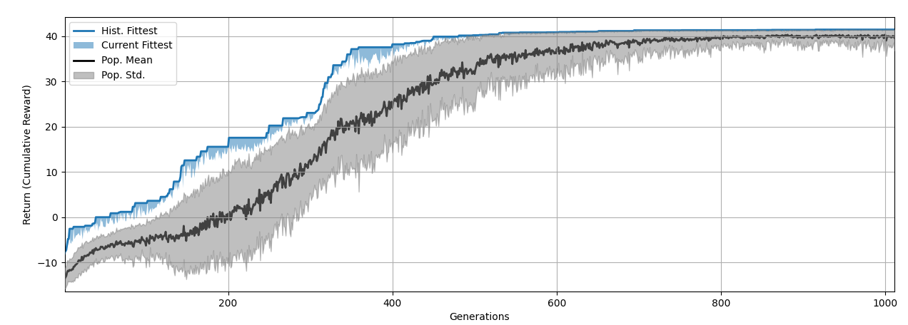
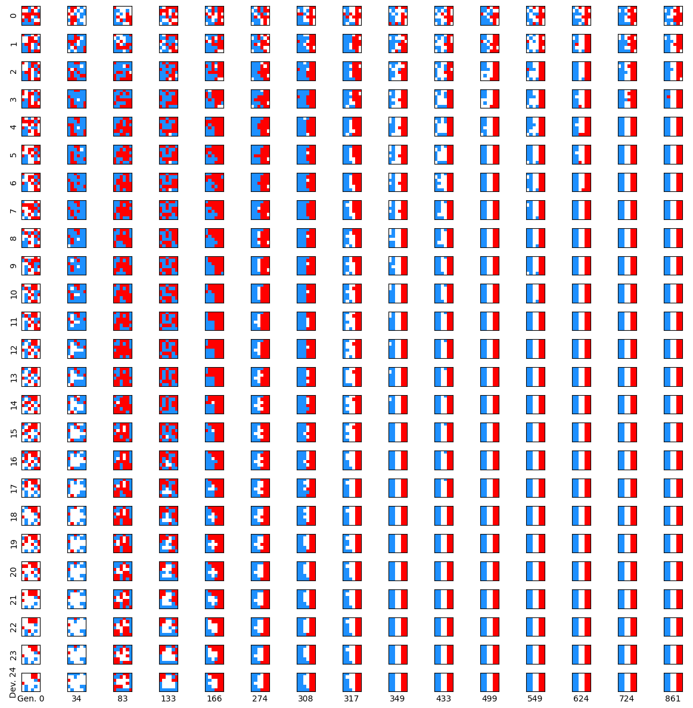

# Evolving Tissue
This example demonstrates how to evolve Neural Cellular Automata (NCAs) to self-assemble different target tissues, such as flags or a smiley-face pattern, from an evolvable initial state. This allows us to compare a direct genetic encoding of the target tissue with an indirect encoding via evolving the functional parameters of a multi-scale competency architecture (MCA) of uni-cellular agents, as introduced in [^1] and [^2].

## _Evolutionary Implications of Self-Assembling Cybernetic Materials_ [^3]
In recent years, the scientific community has increasingly recognized the complex multi-scale competency architecture (MCA) of biology, comprising nested layers of active homeostatic agents, each forming the self-orchestrated substrate for the layer above, and, in turn, relying on the structural and functional plasticity of the layer(s) below. The question of how natural selection could give rise to this MCA has been the focus of intense research. Here, we instead investigate the effects of such decision-making competencies of MCA agential components on the process of evolution itself, using in silico neuroevolution experiments of simulated, minimal developmental biology. We specifically model the process of morphogenesis with neural cellular automata (NCAs) and utilize an evolutionary algorithm to optimize the corresponding model parameters with the objective of collectively self-assembling a two-dimensional spatial target pattern (reliable morphogenesis). Furthermore, we systematically vary the accuracy with which the uni-cellular agents of an NCA can regulate their cell states (simulating stochastic processes and noise during development). This allows us to continuously scale the agents’ competency levels from a direct encoding scheme (no competency) to an MCA (with perfect reliability in cell decision executions). We demonstrate that an evolutionary process proceeds much more rapidly when evolving the functional parameters of an MCA compared to evolving the target pattern directly. Moreover, the evolved MCAs generalize well toward system parameter changes and even modified objective functions of the evolutionary process. Thus, the adaptive problem-solving competencies of the agential parts in our NCA-based in silico morphogenesis model strongly affect the evolutionary process, suggesting significant functional implications of the near-ubiquitous competency seen in living matter.


<br>**Figure 1 from [^3]**: **Illustration of different ways of genetic encodings** of a phenotype of, here, a two-dimensional smiley-face tissue composed of single cells. 
(**A**) Direct encoding: Each gene encodes a specific phenotypic trait, here, of each specific cell type of the tissue, colored blue, pink, and white. 
(**B**) Indirect encoding: A deterministic mapping between the genome and different phenotypic traits, here, again of each cell type (shown for completeness, but not investigated here due to reasons discussed in the Section 5). 
(**C**) Multi-scale competency architecture: Encoding of functional parameters of the uni-cellular agents which self-assemble a target pattern via successive local perception–action cycles [[2](https://doi.org/10.1007/s00018-023-04790-z)] (as detailed in Figure 2A). In all three panels, we schematically illustrate, from left to right, the genome, the respective encoding mechanism, and the corresponding phenotype; colors indicate cell types, and arrows indicate the flow of information and environmental noise, affecting each cell during the developmental process.


<br>**Figure 2. from [^3]** 
(**A**) Detailed information flow-chart of the perception–action cycle of a particular single cell agent, labeled i, in a neural cellular automaton (NCA)-based multi-scale competency architecture (cf. Figure 1C and [^3] [Section 3.1](https://www.mdpi.com/1099-4300/26/7/532#sec3dot1-entropy-26-00532)): Starting from a multi-cellular phenotype configuration at time $t_k$ (left smiley-face panel), and following the thick orange arrows, each cell i perceives cell state information about its respective local neighborhood of the surrounding tissue (respectively labeled). This input is passed through an artificial neural network (ANN), substituting the internal decision-making machinery of a single cell, until an action output is proposed that induces a (noisy) cell state update in the next developmental step at time $t_{k+1}$ (details on labeled internal ANN operation and ANN architectures are introduced later in [Section 3.1](https://www.mdpi.com/1099-4300/26/7/532#sec3dot1-entropy-26-00532)) and Appendix A). 
(**B**) Schematic illustration—following Ref. [[2](https://doi.org/10.1007/s00018-023-04790-z)]—of the evolution of a morphogenesis process with a multi-scale competency architecture acting as the developmental layer between genotypes and phenotypes (see [Section 3.1](https://www.mdpi.com/1099-4300/26/7/532#sec3dot1-entropy-26-00532)) and [Section 3.2](https://www.mdpi.com/1099-4300/26/7/532#sec3dot2-entropy-26-00532) for details): The genotype (top) encodes the structural (initial cell states) and functional parts (decision-making machinery) of a uni-cellular phenotype (center). The cell’s decision-making machinery is represented as a potentially recurrent ANN (yellow/orange graph) with an adjustable competency level (red knob). Through repeated local interactions (perception–action cycles; detailed in panel (**A**), the multi-cellular collective self-orchestrates the iterative process of morphogenesis and forms a final target pattern, i.e., a system-level phenotype after a fixed number of developmental steps (bottom left to right) while being subjected to noisy cell state updates at each step (red arrows). The evolutionary process solely selects at the level of the system-level phenotypes (labeled Final State at the bottom right). Based on a phenotypic fitness criterion, the corresponding genotypes, composed of the initial cell states (bottom left) and the functional ANN parameters (top right, are subject to evolutionary reproduction—recombination and mutation operations—to form the next generation of cellular phenotypes that successively “compute” the corresponding system-level phenotypes via morphogenesis, etc. 

## Project Structure
Here, we specify a training and testing pipeline for training NCAs to assemble different target tissues, such as flags or a smiley-face pattern.
- Different Target-Tissue-Tasks are located in the [tasks](tasks) directory.
- Different NCA-Agent configurations are located in the [agents](agents) directory.
- Different training and testing configurations are located in the [configs](configs) directory.

The agents in the [agents](agents) directory are composed of different ANN architectures and genome modules. They can be loaded with the `mindcraft.Agent` class. The naming is specified as follows:
- sensory module type (`sm_*`) with "ff" for feed-forward, etc.
- aggregation method of sensory module (`embd_*`) with "mean" or "flat"
- policy module type (`pm_*`) with "ff" for feed-forward, "rgrn" for recurrent GRN, etc.

The agents have a **structural genome**, specifying the initial state of the NCA, and a **functional genome**, specifying the parametric weights of the ANN modules (see Fig. 2B).

## The French-Flag Example
See also the [notebook version](example-french_6x6.ipynb) of this example.
### Training
Specify the task id (`french_6x6.json`) and the agent (`sm_ff-embd_mean-pm_ff.yml`) to train the agent on the French-Flag task via:
```bash
python main.py train french_6x6.json sm_ff-embd_mean-pm_ff.yml
```

The output directory is defined through the `examples.evolve.flags.helper.get_files(...)` function, 
and roughly translates to `"<examples.evolve.flags.helper.DATA_FOLDER>/<task>/<prefix>/<agent-file-name-without-basedir-and-ending>"` with optional `--prefix`,
i.e., `"data/french_6x6/sm_ff-embd_mean-pm_ff` in the above case.

### Monitoring the Progress
```bash
python main.py progress french_6x6.json sm_ff-embd_mean-pm_ff.yml
```



or tail the log file directly via
```bash
tail -f data/french_6x6/sm_ff-embd_mean-pm_ff/agent.log
```

### Testing the French-Flag
Run the trained agent on the French-Flag task via
```bash
python main.py test french_6x6.json sm_ff-embd_mean-pm_ff.yml
```

or to start from a particular evolutionary **checkpoint**, run
```bash
python main.py test french_6x6.json sm_ff-embd_mean-pm_ff.yml --checkpoint "{\"runs\": -1, \"gens\": -1}"
```

### Monitor Structural Fitness and Evo/Devo State-Plot from Checkpoints
```bash
python main.py checkpoints french_6x6.json sm_ff-embd_mean-pm_ff.yml --show-state "palette" --show-progress
```
From top to bottom: developmental steps; 
from left to right: generations.

 
### Accelerated Training
Use **`mpi4py`** for accelerated training:
```bash
mpirun -n 8 python main.py train french_6x6.json sm_ff-embd_mean-pm_ff.yml
```
In this case, the population will be evaluated in parallel on `-n 8` cores.

### Train with `SimpleGA`
```bash
python main.py train french_6x6.json sm_ff-embd_mean-pm_ff.yml --config configs/train_SimpleGA.yml
```

### Continue Training
```bash
python main.py train french_6x6.json sm_ff-embd_mean-pm_ff.yml --continue-training "{\"runs\": -1, \"gens\": -1}"
```
continues the training from the last run and generation.

### Transfer Learning
To perform _transfer-learning_ from e.g. a French-Flag agent trained on a 6x6 grid _to an OOE (Upper Austrian) Flag_ also on a 6x6 grid, we can run: 
```bash
python main.py train ooe_6x6.json pretrained/french_6x6/sm_ff-embd_mean-pm_ff/agent.yml --prefix pretrained/french_6x6/sm_ff-embd_mean-pm_ff
```
which can be **tested** via 
```bash
python main.py test ooe_6x6.json pretrained/french_6x6/sm_ff-embd_mean-pm_ff/agent.yml --prefix pretrained/french_6x6/sm_ff-embd_mean-pm_ff
```

Notably, 
- we used a [pretrained agent file](agents/pretrained/french_6x6/sm_ff-embd_mean-pm_ff/agent.yml) located at `pretrained/french_6x6/sm_ff-embd_mean-pm_ff/agent.yml` within the `agents`` folder,
- and, we specified a dedicated `prefix` for the output directory.


## For help
```bash
python main.py --help
```

```bash
python main.py train --help
```

```bash
python main.py test --help
```

```bash
python main.py progress --help
```

## Cite as
If you use this code in your research, please cite the following publication:
```bibtex
@article{hartl2024evolutionary,
    author = {Hartl, Benedikt and Risi, Sebastian and Levin, Michael},
    title = {Evolutionary Implications of Self-Assembling Cybernetic Materials with Collective Problem-Solving Intelligence at Multiple Scales},
    journal = {Entropy},
    volume = {26},
    year = {2024},
    number = {7},
    article-number = {532},
    doi = {10.3390/e26070532}
}
```

## References
[^1]: "_Technological Approach to Mind Everywhere: An Experimentally-Grounded Framework for Understanding Diverse Bodies and Minds_",
<br>by M. Levin, Frontiers in Systems Neuroscience 2022, **16**; https://doi.org/10.3389/fnsys.2022.768201

[^2]: "_Darwin’s agential materials: evolutionary implications of multiscale competency in developmental biology_",
<br>by M. Levin, Cellular and Molecular Life Sciences 2023, **80**, 142; https://doi.org/10.1007/s00018-023-04853-5

[^3]: "_Evolutionary Implications of Self-Assembling Cybernetic Materials with Collective Problem-Solving Intelligence at Multiple Scales_", 
<br>by B. Hartl, S. Risi, M. Levin, Entropy 2024, **26**(7), 532; https://doi.org/10.3390/e26070532
